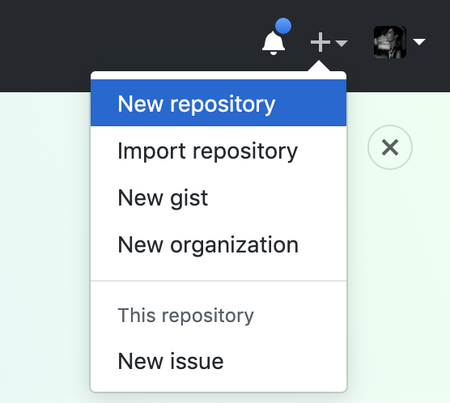
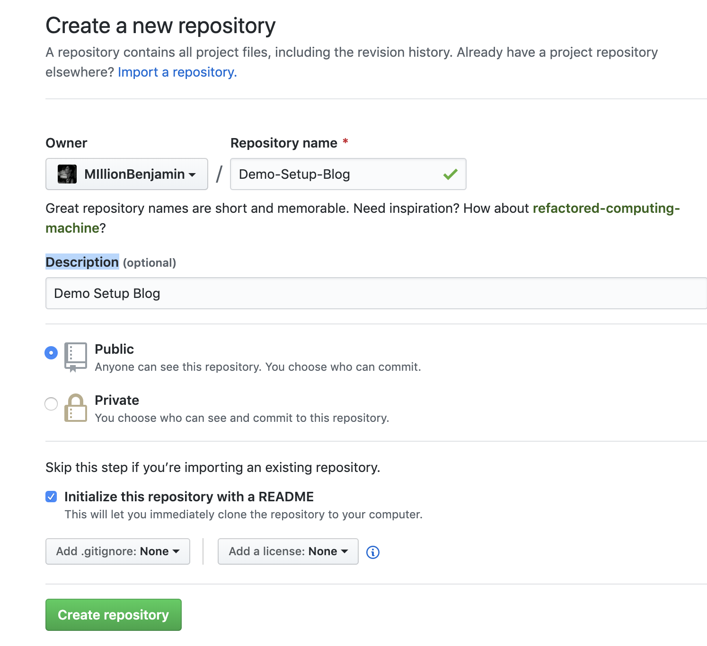
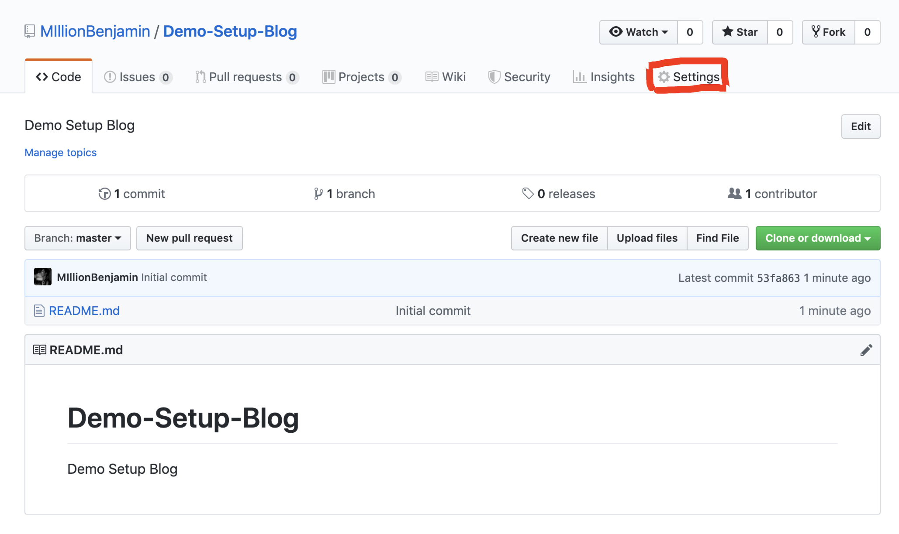
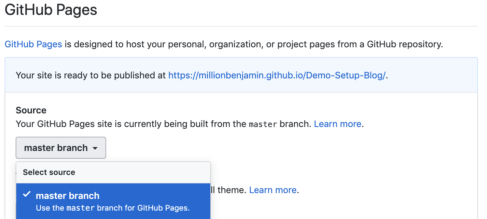
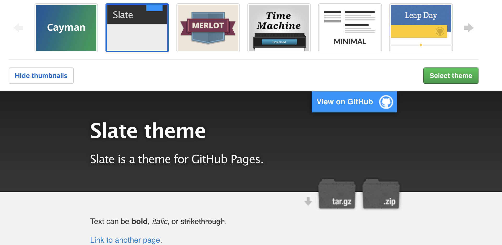
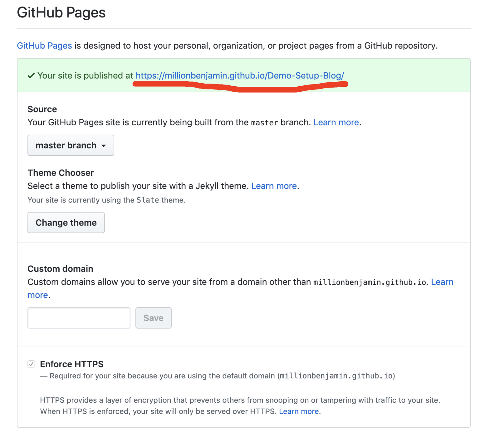
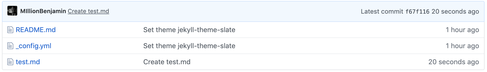
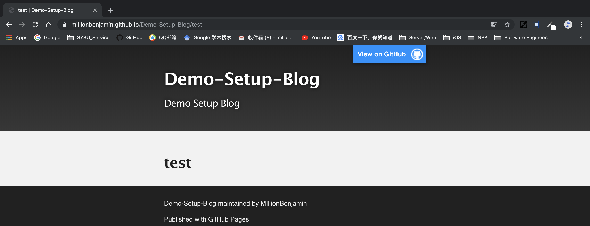
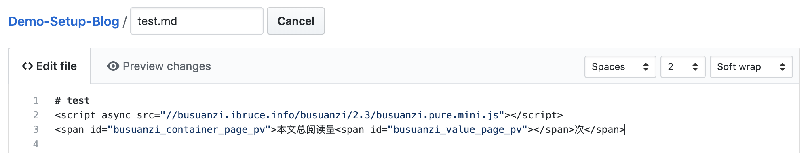
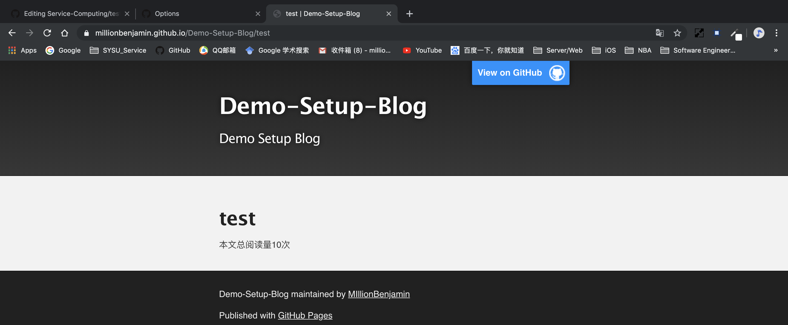

# 在GitHub上建立个人博客并且在博客中显示网页访问量
> 关键词：Github、博客、网页访问量
<br>


<script async src="//busuanzi.ibruce.info/busuanzi/2.3/busuanzi.pure.mini.js"></script>
<span id="busuanzi_container_page_pv">本文总阅读量<span id="busuanzi_value_page_pv"></span>次</span>

## 一、建立博客

### 1. 在GitHub个人页面创建新repository

可以点击GitHub页面右上方的 “+” 号，选择 `New repository` 以建立新repository


此时进入创建页面，这里的 `Repository name` 会是你以后个人博客的默认大标题，`Description` 则会是博客的副标题。

__注意__：最好勾上 `Initialize this repository with a README` 的选项，以便后续直接建立GitHub Pages


点击 `Create repository` 完成创建

### 2. 为建立好的repository设置GitHub Pages

点击右上方 `Settings` 按钮进入设置页面


进入后下滑至 `GitHub Pages` 设置区域

- 将 `Source` 设为 `master branch`


- 然后点击 `Choose a theme` 按钮，进入博客主题选择页面。选择你喜欢的主题，点击绿色的 `Select theme` 按钮完成选择。


完成主题选择后，GitHub Pages即设置完毕，此时会自动跳转到这个repository的 `README.md` 页面，会发现 `README.md` 中的内容被GitHub Pages初始化。

### 3. 后续的使用

设置完成后，博客的URL可在repository `Settings` 的 `GitHub Pages` 区域查看。可见，示例的博客URL是 https://millionbenjamin.github.io/Demo-Setup-Blog/


这里显示的URL指向该repository的 `README.md` （repository中的.md文件在网页上会被渲染成你选择的主题） 

要添加博客页面，可以在repository添加.md文件。而对于该.md文件的URL，只需在先前 `Settings` 中得到的URL末尾加上该.md文件的无后缀文件名。
<br>
例如在示例repository中添加一个 `test.md` 文件，则对应博客页面URL为 https://millionbenjamin.github.io/Demo-Setup-Blog/test





## 二、在博客中显示网页访问量
只要在.md文件中任意位置添加以下两行代码：
```html
<script async src="//busuanzi.ibruce.info/busuanzi/2.3/busuanzi.pure.mini.js"></script>
<span id="busuanzi_container_page_pv">本文总阅读量<span id="busuanzi_value_page_pv"></span>次</span>
```
在博客页面对应位置即会显示网页访问量

例如，在test.md中添加这两行代码：


在博客页面上产生的效果：



