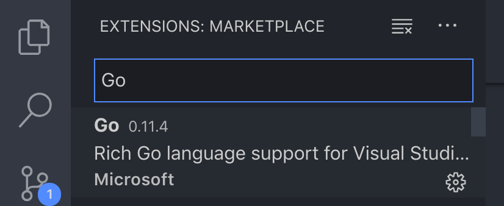
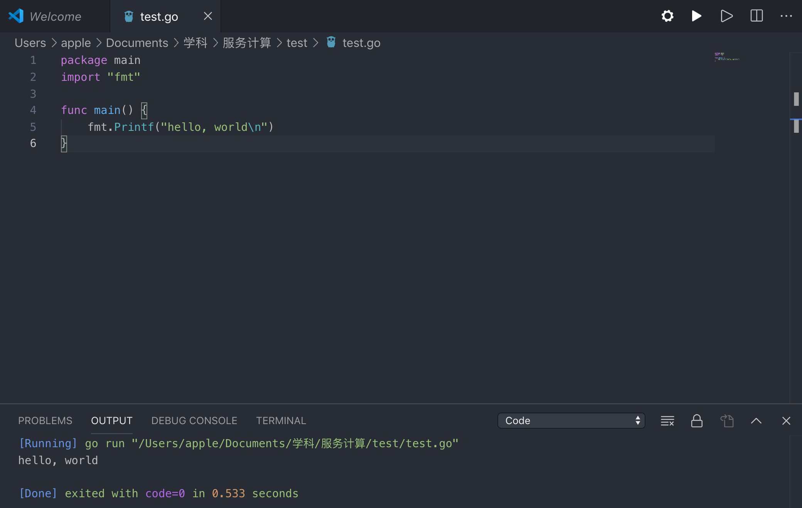

# 在MacOS上配置Golang开发环境
> 关键词：MacOS、Golang、VScode
<br>


<script async src="//busuanzi.ibruce.info/busuanzi/2.3/busuanzi.pure.mini.js"></script>
<span id="busuanzi_container_page_pv">本文总阅读量<span id="busuanzi_value_page_pv"></span>次</span>

## 一、命令行安装Golang
打开Terminal按顺序输入以下命令即可

### 1. 升级Homebrew
```shell
brew update
```

### 2. 使用Homebrew安装
```shell
brew install golang
```

### 3. 检验安装
```shell
go version
```

## 二、配置环境变量
当前1.9版本的go已经不用手动地在Shell配置文件中显式设置 `GOPATH` 和 `GOROOT`。在命令行中输入 `go env` 查看当前go的各项环境变量。
### 1. GOPATH
`GOPATH` 是Go的工作目录，指定了需要从哪个地方寻找GO的包、可执行程序等。用 `go get` 下载的包都放在该目录下。

### 2. GOROOT
`GOROOT` 是Go语言编译、工具、标准库的安装路径。

要自定义环境变量，请在修改主目录下的 `.bash_profile`, `.bashrc` 或 `.zshrc` 文件，在其末尾添加如下语句：（等号右边是自定义的路径）
```bash
#GOPATH
export GOPATH=/Users/apple/go

#GOROOT
export GOROOT=/usr/local/Cellar/go/1.12.9/libexec

#GOPATH root bin
export PATH=$PATH:$GOROOT/bin
```

## 二、配置VScode

在VScode扩展包条目的搜索栏中输入 `Go` ，搜索结果的第一项即是VScode的Go语言扩展，点击安装即可


安装完成后即可在VScode中编辑并运行.go文件


也可自行在VScode安装更多与Go语言有关的扩展。

<br>

#### [Support Me](https://millionbenjamin.github.io/Service-Computing/SupportMe)