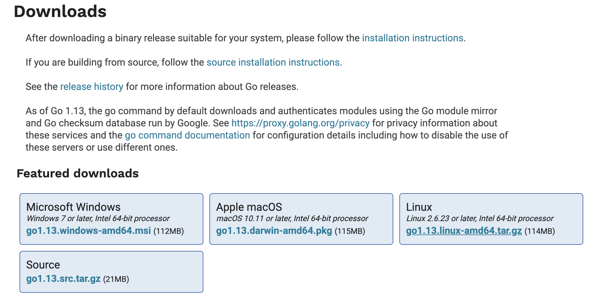

# 在CentOS 7上安装VScode并配置Golang开发环境（详细）
> 关键词：CentOS、Golang、VScode
<br>


<script async src="//busuanzi.ibruce.info/busuanzi/2.3/busuanzi.pure.mini.js"></script>
<span id="busuanzi_container_page_pv">本文总阅读量<span id="busuanzi_value_page_pv"></span>次</span>

- [在CentOS 7上安装VScode并配置Golang开发环境（详细）](#%e5%9c%a8centos-7%e4%b8%8a%e5%ae%89%e8%a3%85vscode%e5%b9%b6%e9%85%8d%e7%bd%aegolang%e5%bc%80%e5%8f%91%e7%8e%af%e5%a2%83%e8%af%a6%e7%bb%86)
  - [一、安装VScode](#%e4%b8%80%e5%ae%89%e8%a3%85vscode)
  - [二、安装并配置golang](#%e4%ba%8c%e5%ae%89%e8%a3%85%e5%b9%b6%e9%85%8d%e7%bd%aegolang)
  - [三、VScode中的golang相关工具](#%e4%b8%89vscode%e4%b8%ad%e7%9a%84golang%e7%9b%b8%e5%85%b3%e5%b7%a5%e5%85%b7)
  - [附 在CentOS下运行 `.AppImage` 文件](#%e9%99%84-%e5%9c%a8centos%e4%b8%8b%e8%bf%90%e8%a1%8c-appimage-%e6%96%87%e4%bb%b6)
      - [Support Me](#support-me)


## 一、安装VScode
在yum库中已经发布了稳定的64位VScode
<br>
在CentOS命令行中输入以下命令，该脚本将安装密​​钥和存储库：
```shell
sudo rpm --import https://packages.microsoft.com/keys/microsoft.asc
```
```shell
sudo sh -c 'echo -e "[code]\nname=Visual Studio Code\nbaseurl=https://packages.microsoft.com/yumrepos/vscode\nenabled=1\ngpgcheck=1\ngpgkey=https://packages.microsoft.com/keys/microsoft.asc" > /etc/yum.repos.d/vscode.repo'
```

然后使用 `yum` 安装：
```shell
yum check-update
sudo yum install code
```

要运行VScode，在CentOS命令行中输入 `code` 即可。

## 二、安装并配置golang
到[Go官网下载](https://golang.org/dl/)Linux的Go发行包：

现在可以下载的最新稳定版本是 `go1.13.linux-amd64.tar.gz`

下载完成后，在命令行中进入该发行包所在目录，运行以下命令。
```shell
sudo tar -C /usr/local -xzf go1.13.linux-amd64.tar.gz
```
然后配置环境变量。打开 `/etc/profile` （全系统安装）或 `$HOME/.profile` ，添加以下语句：
```bash
export PATH=$PATH:/usr/local/go/bin
```

退出当前系统用户，重新登录后，在命令行运行 `go version` 检验安装。


## 三、VScode中的golang相关工具
在VScode中创建 `.go` 文件，右下角会弹窗提示要安装一些工具，点击 `Install All` 即可自动安装所有相关工具。必须科学上网才能全部成功安装。

__当虚拟机用NAT模式联网时，在主机上连接VPN，虚拟机也上可收获效果__


## 附 在CentOS下运行 `.AppImage` 文件

也许你会想在CentOS上安装一个VPN应用，它的Linux版本是 `.AppImage` 文件。要运行 `.AppImage` 文件：

命令行中依次输入
```shell
chmod a+x *.AppImage
sudo ./*.AppImage
``` 
其中*可以是要运行的文件名。

<br>

#### [Support Me](https://millionbenjamin.github.io/Service-Computing/SupportMe)