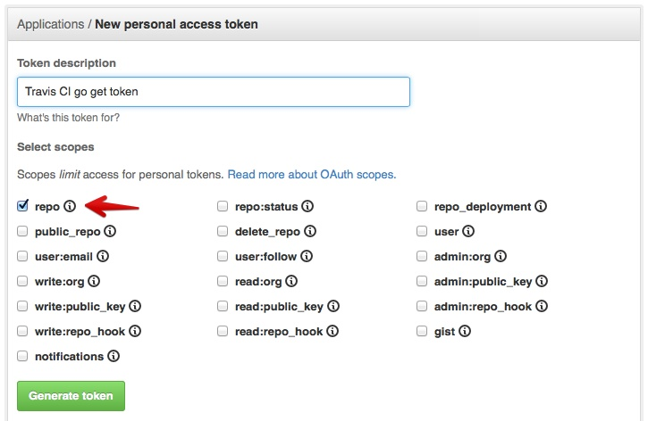

# Travis CI - Building a Go Project（Travis CI-建立Go项目）官方文档翻译
> 关键词：Travis CI、Golang

> _Translated by MillionBenjamin(me)_
> <br>
> _Here is the [Original English Version](https://docs.travis-ci.com/user/languages/go/)_
> <br>
> 由MillionBenjamin翻译
> <br>
> 原文见[此链接](https://docs.travis-ci.com/user/languages/go/)
<br>


<script async src="//busuanzi.ibruce.info/busuanzi/2.3/busuanzi.pure.mini.js"></script>
<span id="busuanzi_container_page_pv">本文总阅读量<span id="busuanzi_value_page_pv"></span>次</span>

- [Travis CI - Building a Go Project（Travis CI-建立Go项目）官方文档翻译](#travis-ci---building-a-go-projecttravis-ci-%e5%bb%ba%e7%ab%8bgo%e9%a1%b9%e7%9b%ae%e5%ae%98%e6%96%b9%e6%96%87%e6%a1%a3%e7%bf%bb%e8%af%91)
  - [规定使用的Go版本](#%e8%a7%84%e5%ae%9a%e4%bd%bf%e7%94%a8%e7%9a%84go%e7%89%88%e6%9c%ac)
  - [Go 模块](#go-%e6%a8%a1%e5%9d%97)
  - [Go Import 路径](#go-import-%e8%b7%af%e5%be%84)
  - [依赖管理](#%e4%be%9d%e8%b5%96%e7%ae%a1%e7%90%86)
    - [godep 支持](#godep-%e6%94%af%e6%8c%81)
    - [安装私有依赖](#%e5%ae%89%e8%a3%85%e7%a7%81%e6%9c%89%e4%be%9d%e8%b5%96)
  - [默认构造脚本](#%e9%bb%98%e8%ae%a4%e6%9e%84%e9%80%a0%e8%84%9a%e6%9c%ac)
  - [环境变量](#%e7%8e%af%e5%a2%83%e5%8f%98%e9%87%8f)
  - [构建配置参考](#%e6%9e%84%e5%bb%ba%e9%85%8d%e7%bd%ae%e5%8f%82%e8%80%83)
  - [示例](#%e7%a4%ba%e4%be%8b)


<aside markdown="block" class="ataglance">

| Go                                          | Default                                                      |
|:--------------------------------------------|:-------------------------------------------------------------|
| [默认 `install`](#dependency-management) | `travis_install_go_dependencies <go-version> [gobuild-args]` |
| [默认 `script`](#default-build-script)   | `travis_script_go {gobuild-args}`                            |
|Matrix 键               | `go`, `env`                                                  |
| 支持                                     | [Travis CI](mailto:support@travis-ci.com)                    |

最小配置示例:

```yaml
language: go
```
{: data-file=".travis.yml"}

注意，若要使用Go 1.10，则必须用语句 `go: "1.10"` （字符串），而不是 `go: 1.10`（浮点数）。用浮点数的结果是使用Go 1.1。
</aside>

{{ site.data.snippets.linux_windows_note }}

以下指南概括了Go项目在Travis CI中的配置。如果你是第一次使用Travis CI请阅读我们的[教程](https://docs.travis-ci.com/user/tutorial/)和[构建配置](https://docs.travis-ci.com/user/customizing-the-build/)

## 规定使用的Go版本

你可以用Go的任何标记版本，在次要或补丁标准的位置填上 `x` 以使用一个给定的主要或次要版本。或者使用 `master` 来从源代码获得最新版本。所有的go版本管理都由[gimme](https://github.com/travis-ci/gimme)处理。
```yaml
language: go

go:
- 1.x
- "1.10"
- 1.11.x
- master
```
{: data-file=".travis.yml"}

## Go 模块
任何通过 `.travis.yml` 或仓库设置的 `GO111MODULE` 值会回复原样。如果缺省，那么会设置默认值 `GO111MODULE=auto`。

## Go Import 路径
项目源代码会被放置在 `GOPATH/src/{repo-source}` ，但如果需要导入[vanity imports](https://golang.org/cmd/go/#hdr-Remote_import_paths)（特别是对于 [`internal` 包](https://golang.org/cmd/go/#hdr-Internal_Directories)），`go_import_path:` 可以在配置的最顶层指定，例如：
```yaml
go_import_path: example.org/pkg/foo
```


## 依赖管理
默认的 `travis_install_go_dependencies <go-version>
[gobuild-args]` 的 `install` 步骤，以及确定环境变量和文件路径，都会随着指定Go版本的不同而变化。

如果Makefile用以下任何名称给出，那么在 `install` 步骤中不会有更进一步的操作：

- `GNUMakefile`
- `Makefile`
- `BSDmakefile`
- `makefile`

在所有其他情况下，执行命令 `go get ${gobuild_args} ./...` 

### godep 支持
当使用vendor的依赖，即 `GOPATH` 带有 `${TRAVIS_BUILD_DIR}/Godeps/_workspace`  前缀，且 `PATH` 带有 `${TRAVIS_BUILD_DIR}/Godeps/_workspace` and `PATH` 前缀时，会有对[godep](https://github.com/tools/godep)的支持。此外，如果 `Godeps/_workspace/src` 目录不存在，将会安装 `godep` 并运行 `godep restore`。

需要注意的是，不支持在顶层使用较旧的模式 `Godeps.json`。

所有 `godep` 集成步骤优先于上文提到的 `go get` 步骤和makefile步骤进行。

注意 `godep` 支持只会在自定义 `install` 步骤不明确时被激活。


### 安装私有依赖

由于 `go get` 使用HTTPS而非SSH葱花Github上克隆依赖，它需要一种与[我们推荐的处理私有依赖方式](https://docs.travis-ci.com/user/private-dependencies)不同的变通方法

当通过HTTPS进行克隆时，git用户在后台使用curl，这允许你指定[.netrc](http://manpages.ubuntu.com/manpages/precise/man5/netrc.5.html)文件。在文件中你可以储存特定域名的自定义身份验证凭据。

访问你的[GitHub账户](https://github.com/settings/applications) 并创建个人访问token。



确保为其提供 `repo` 范围，以允许访问私有库。

为了减少token的访问权限，你也可以分别创建账户，这些账户只能访问你在某项目中需要的特定仓库。

拷贝token并将其储存至你仓库中的 .netrc 文件。遵循以下格式：
```
machine github.com
  login <username>
  password <token>
```

将此添加到你的仓库并在 .travis.yml 文件中加入以下语句：
``` yaml
before_install:
- cp .netrc ~/.netrc
- chmod 600 ~/.netrc
```
{: data-file=".travis.yml"}

## 默认构造脚本
Go项目假定默认使用Make或Go build工具。假使在仓库根目录有Makefile，那么Travis CI默认用此命令运行项目测试套件：
``` bash
make
```

若没有Makefile，则是：

``` bash
go test ${gobuild_args} ./...
```

这些默认命令可以被覆盖，具体描述见[常规构建配置指南](https://docs.travis-ci.com/user/customizing-the-build/)。例如，添加 `-v` flag，覆盖 `.travis.yml` 中的 `script:` 关键字段：
``` yaml
script: go test -v ./...
```
{: data-file=".travis.yml"}

 在配置顶层中，传入默认 `go test` 命令的变量会被指定的 `gobuild_args:` 覆盖，例如：
``` yaml
gobuild_args: -x -ldflags "-X main.VersionString v1.2.3"
```
{: data-file=".travis.yml"}

这会使脚本步骤变为：
``` bash
go test -x -ldflags "-X main.VersionString v1.2.3" ./...
```

运行Scons而不用变量构建，使用：
``` yaml
script: scons
```
{: data-file=".travis.yml"}

## 环境变量
可使用以下版本：
```
TRAVIS_GO_VERSION
```

可以像先前提到的一样，在末尾包含 `.x` 。在部署条件中使用此变量应考虑这种可能性，例如：
```yaml
go:
  - 1.7.x
⋮
deploy:
  ...
  on:
    condition: $TRAVIS_GO_VERSION =~ ^1\.7
```
{: data-file=".travis.yml"}

## 构建配置参考
你可以在这里获得更多关于构建配置格式的信息：
[Travis CI构建配置参考](https://config.travis-ci.com/) 中的 [Go部分](https://config.travis-ci.com/ref/language/go)。


## 示例

- [Go AMQP client](https://github.com/streadway/amqp/blob/master/.travis.yml)
- [mrb/hob](https://github.com/mrb/hob/blob/master/.travis.yml)
- [tsuru/tsuru](https://github.com/tsuru/tsuru/blob/master/.travis.yml)


__[Support Me](https://millionbenjamin.github.io/Service-Computing/SupportMe)__