# 实验一-让你的计算机也能提供云桌面服务

## 一、 实验目的
1. 初步了解虚拟化技术，理解云计算的相关概念
2. 理解系统工程师面临的困境
3. 理解自动化安装、管理（DevOps）在云应用中的重要性

## 二、实验环境与要求
- 用户通过互联网，使用微软远程桌面，远程访问你在PC机上创建的虚拟机
- 虚拟机操作系统 Centos，Ubuntu，或 你喜欢的 Linux 发行版，能使用 NAT 访问外网。

## 三、实验内容
> 主机系统为MacOS，先前已安装VMware并已配置好Linux虚拟机

### 0. VMware的虚拟网络介绍
VMware的虚拟网络都是以"VMnet+数字"的形式来命名的，例如 VMnet0、VMnet1、VMnet2……以此类推(在Linux系统的主机上，虚拟网络的名称均采用小写形式，例如 vmnet0 )。在命令行中查看网络配置信息，可以看到vmnet网卡信息。

VMware会自动创建虚拟网络：VMnet8(NAT模式)、VMnet1(仅主机模式)。也可以根据需要自行创建更多的虚拟网络。

在我的Mac上，于命令行中查看网络配置信息，可以看到VMware的网卡：
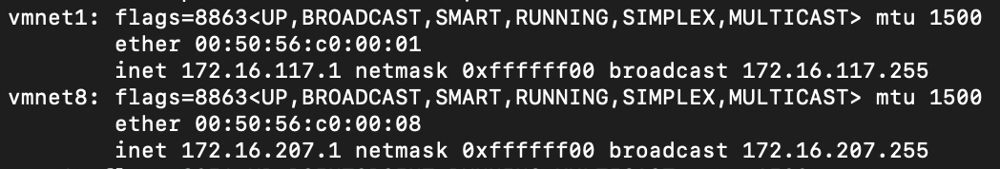

### 1. VMware中创建虚拟机
此图中选定的 `CentOS 7 64-bit Practice` 即为本次实验的 __Base__ 虚拟机。该虚拟机系统安装了桌面GUI。
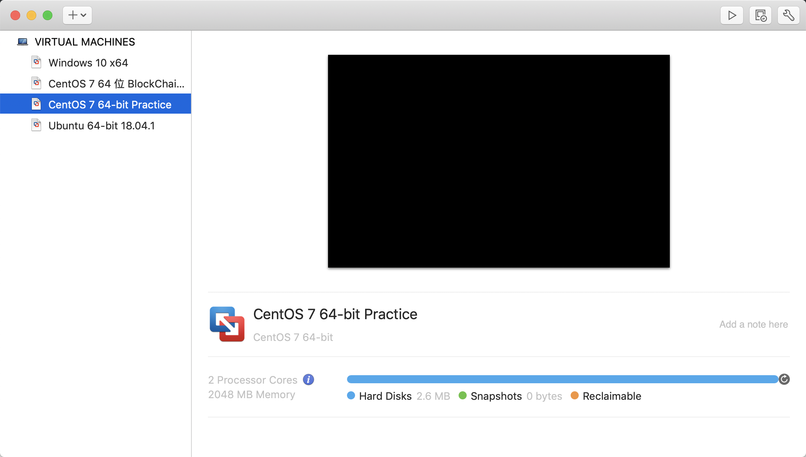

该虚拟机的处理器与内存情况
- 2核
- 2G内存

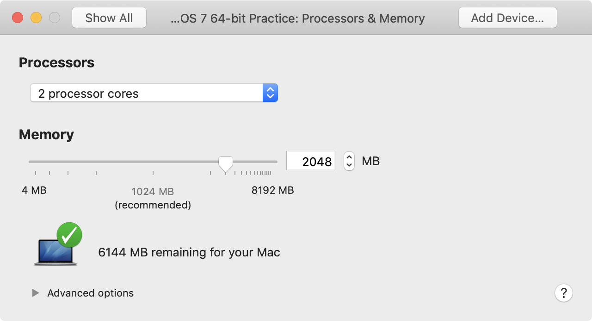

硬盘：30G
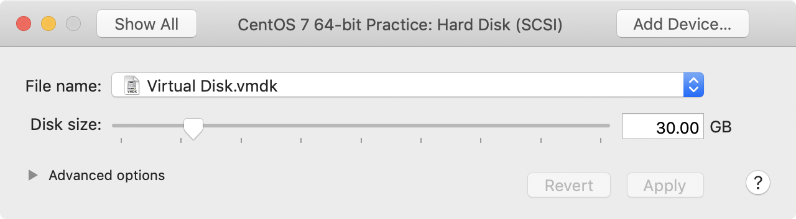

网卡：
- NAT
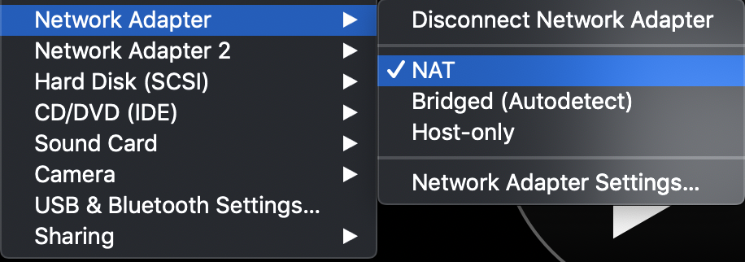
- Host-only
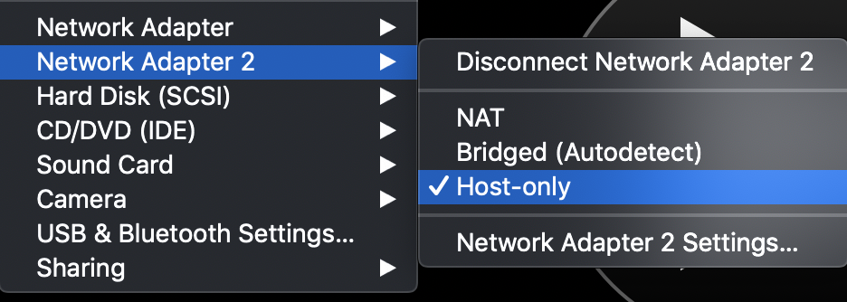

成功换源、升级内核
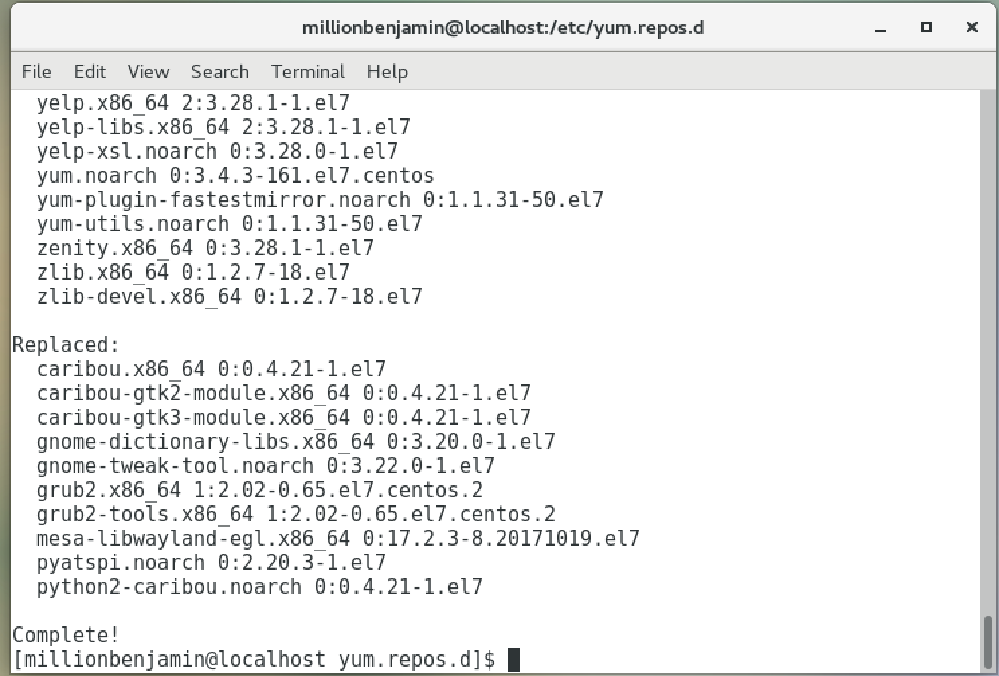
关于Centos 7换阿里云源的步骤，可参考[此博客](https://hacpai.com/article/1551667032520)

ping主机成功
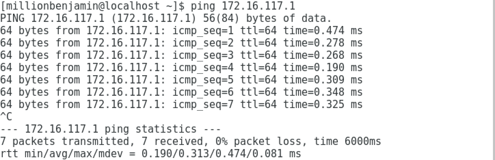

虚拟机网络配置信息（两张网卡均开启）
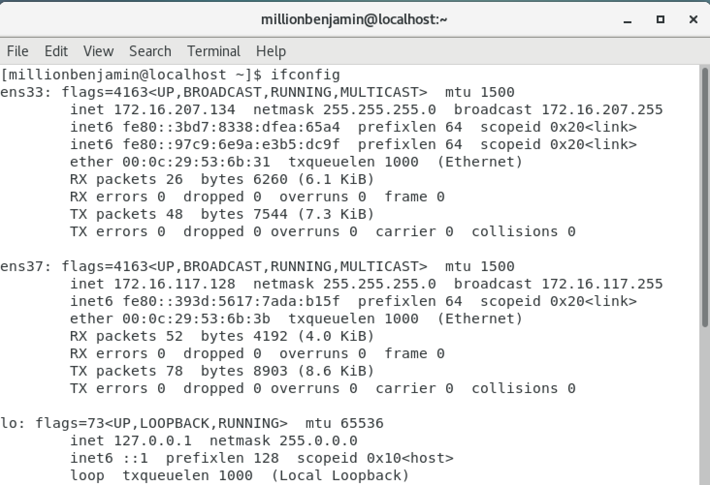

主机ssh连接虚拟机成功，Host-only和NAT的IP地址均可用
- Host-only
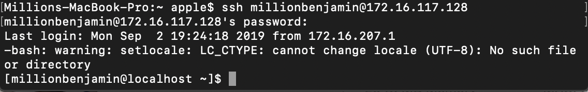
- NAT
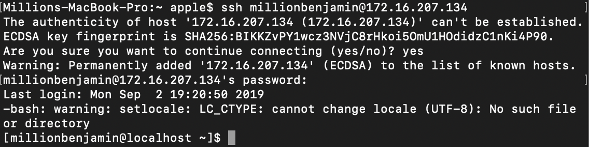

### 2. 链接复制
创建Base虚拟机 `CentOS 7 64-bit Practice` 的链接复制
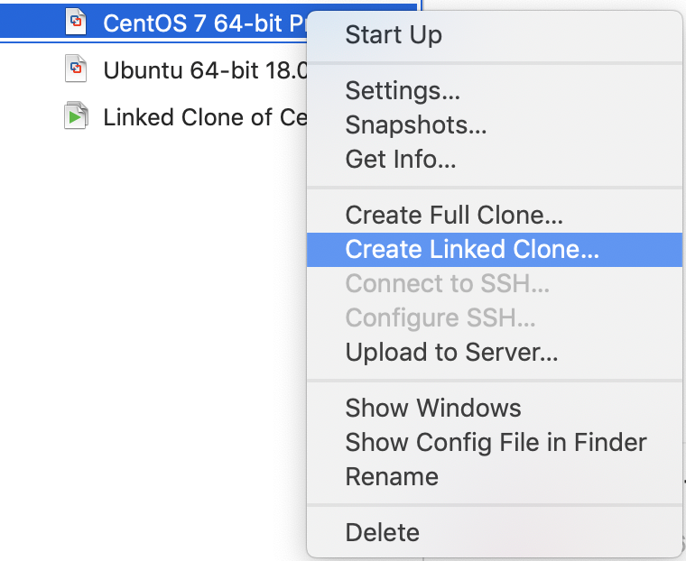

在VMware中，链接复制会自动更新网卡MAC地址。
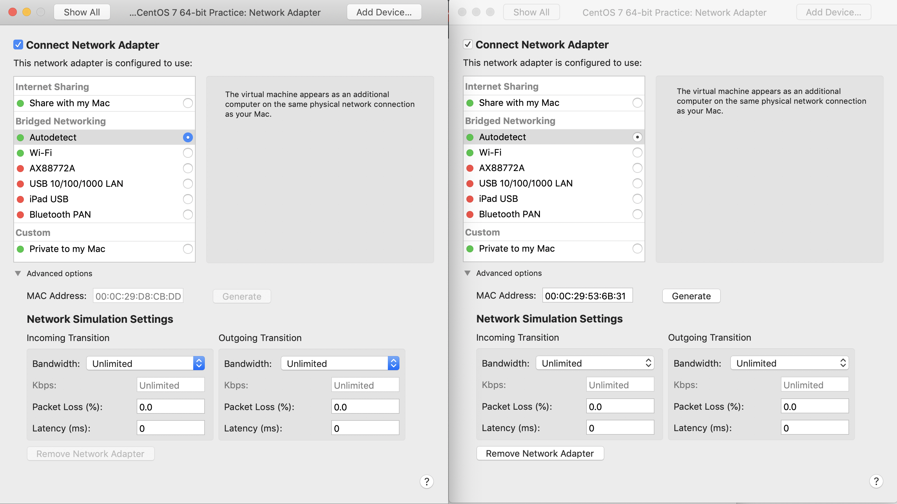
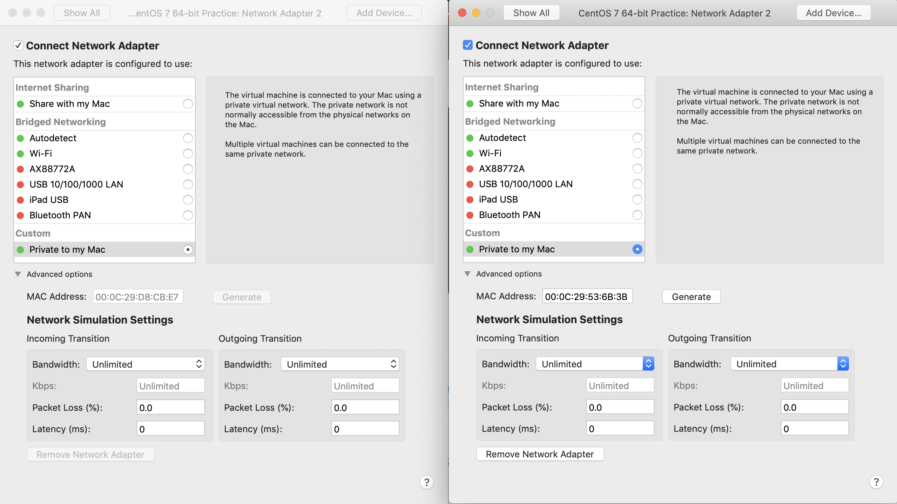

克隆虚拟机网络配置信息（两张网卡均开启）
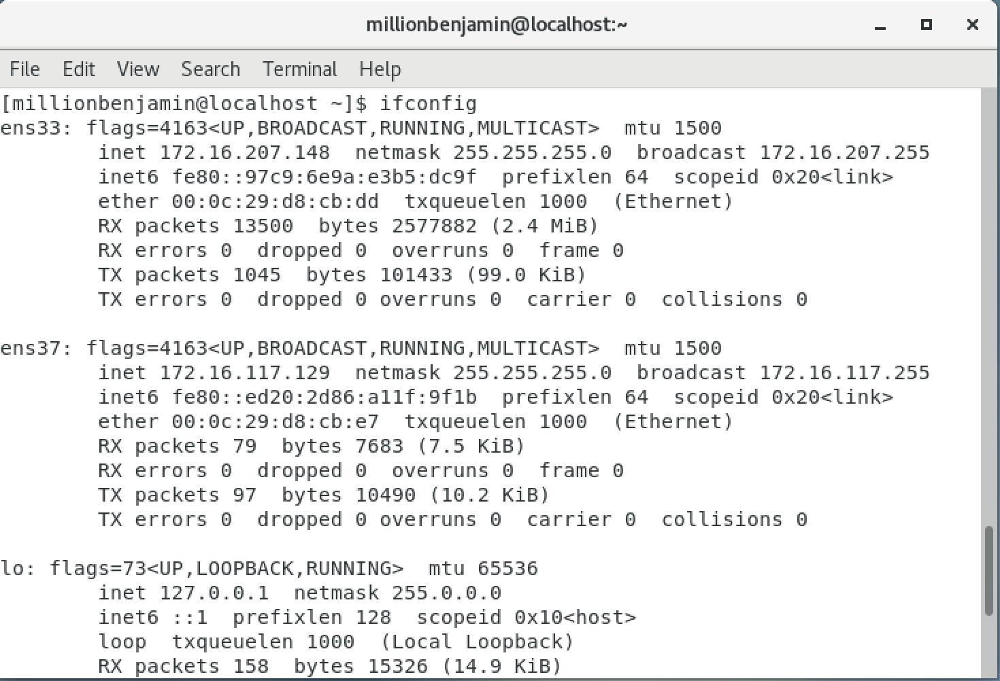

主机ssh连接克隆虚拟机成功，Host-only和NAT的IP地址均可用
- Host-only
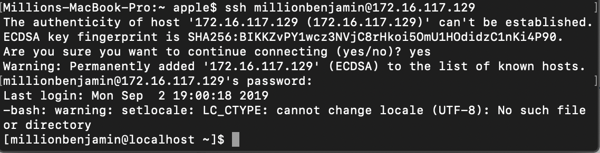
- NAT
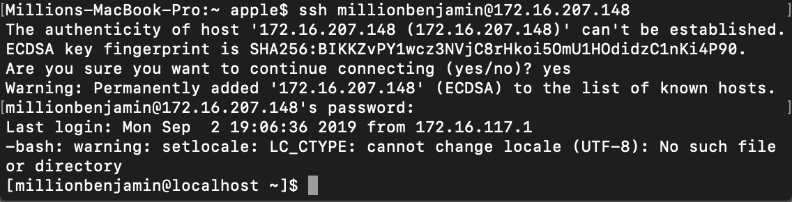

### 3. 远程桌面
起初在CentOS（GUI）的设置中发现了 `Sharing` 相关设置，其中有 `Screen Sharing` 选项，默认是OFF，本想直接将其设为ON却发现无法更改。

在CentOS命令行中配置好 `VNC Server` 后，才能将`Screen Sharing` 选项调成ON。

关于CentOS配置 `VNC Server` ，可参考[此博客](https://qizhanming.com/blog/2018/03/06/how-to-config-vnc-server-on-centos-7)

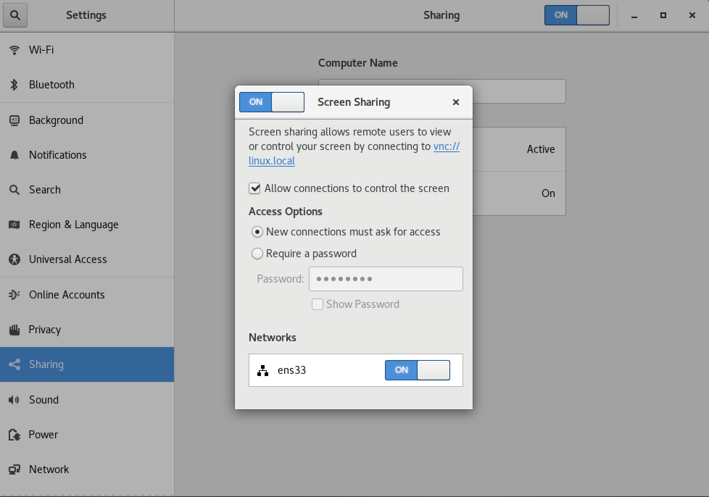
__注意__：此处可见 `Screen Sharing` 启用的是 `ens33` 网卡，后续在客户端地址栏要输入对应该网卡的IP地址才能成功连接。

而后在MacOS中下载 `VNC Viewer`，即VNC客户端。[下载网址](https://www.realvnc.com/en/connect/download/viewer/macos/)

打开VNC Viewer，在地址栏中输入要访问的远程桌面的IP地址。__注意__：IP地址后要附加":1"，表示第一个桌面。
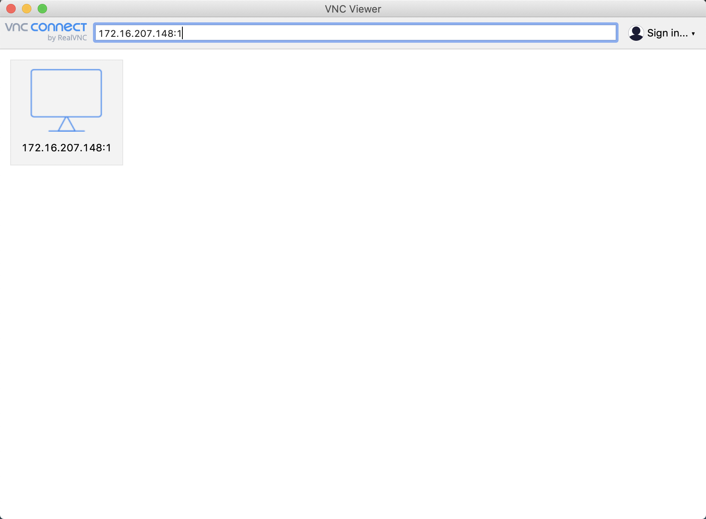

按照提示输入密码后即成功连接到远程桌面。
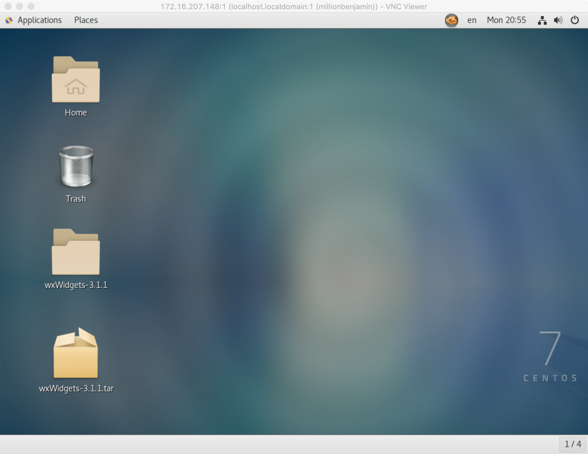