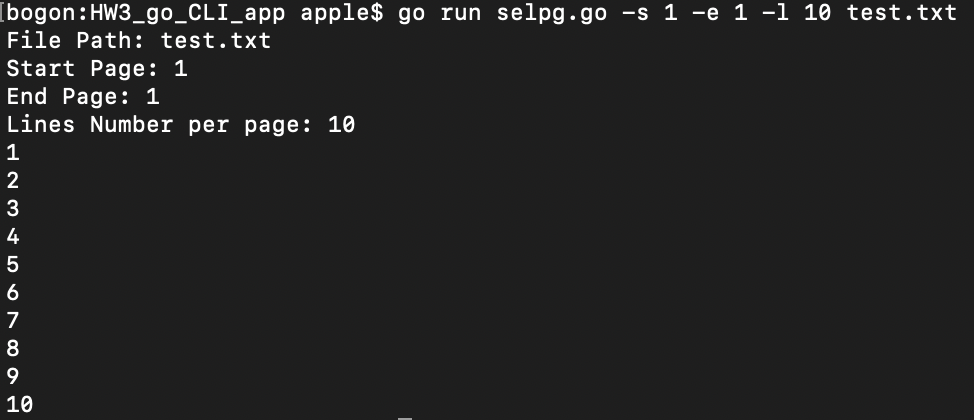
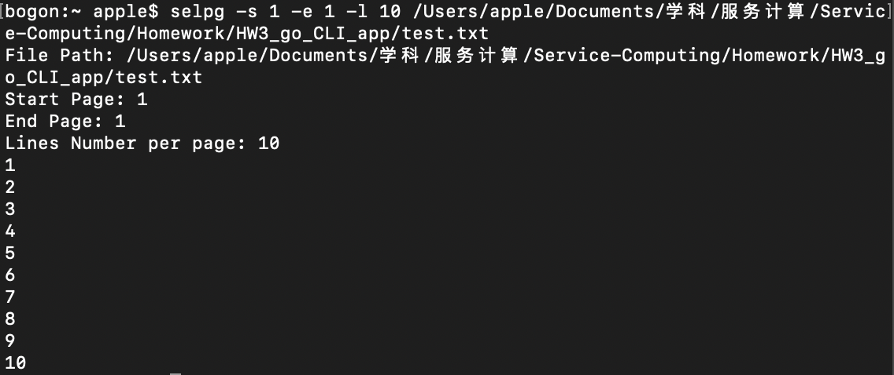

# Go语言命令行应用 —— selpg

> 使用流行的Go命令行应用开发包[github.com/urfave/cli](https://github.com/urfave/cli#using-v1-releases)
<br>完整代码见[selpg.go](./selpg.go)

- [Go语言命令行应用 —— selpg](#go%e8%af%ad%e8%a8%80%e5%91%bd%e4%bb%a4%e8%a1%8c%e5%ba%94%e7%94%a8--selpg)
  - [一、命令参数设定](#%e4%b8%80%e5%91%bd%e4%bb%a4%e5%8f%82%e6%95%b0%e8%ae%be%e5%ae%9a)
  - [二、文件读操作](#%e4%ba%8c%e6%96%87%e4%bb%b6%e8%af%bb%e6%93%8d%e4%bd%9c)
  - [三、部署与运行](#%e4%b8%89%e9%83%a8%e7%bd%b2%e4%b8%8e%e8%bf%90%e8%a1%8c)


## 一、命令参数设定

设置开始页面、结束页面和每页行数三个Flag

``` Go
app.Flags = []cli.Flag{
		cli.StringFlag{
			Name:  "start, s",
			Value: "1",
			Usage: "Start Page",
		},
		cli.StringFlag{
			Name:  "end, e",
			Value: "1",
			Usage: "End Page",
		},
		cli.StringFlag{
			Name:  "lNumber, l",
			Value: "72",
			Usage: "Lines Number per Page",
		},
```

这三个Flag的用法如下：

``` shell
GLOBAL OPTIONS:
   --start value, -s value    Start Page (default: "1")
   --end value, -e value      End Page (default: "1")
   --lNumber value, -l value  Lines Number per Page (default: "72")
   --help, -h                 show help
   --version, -v              print the version
```

除了这三个Flag，命令还应有一个单独的参数，是文件路径：

``` Go
app.Action = func(c *cli.Context) error {
		fileName := ""
		if c.NArg() > 0 {
			fileName = c.Args().Get(0)
        }
        ...
```

## 二、文件读操作

由开始页面、结束页面和每页行数，计算出开始行和结束行：

``` Go
startLine := lineNumber*(startPage-1) + 1
endLine := lineNumber * endPage
```

打开所需文件，从第一行开始读，若读到的行在\[开始行，结束行\]的范围内，则输出该行。当读到的行超过结束行，或者已到文件末尾，则停止读取。

``` Go
fi, err := os.Open(fileName)
if err != nil {
	fmt.Printf("Error: %s\n", err)
	return nil
}
defer fi.Close(
br := bufio.NewReader(fi)
currentLine := 1
for {
	a, _, c := br.ReadLine()
	if c == io.EOF {
		break
	}
	if currentLine >= startLine &currentLine <= endLine {
		fmt.Printf("%s\n", string(a))
	}
	currentLine++
	if currentLine > endLine {
		break
	}
}
```

## 三、部署与运行

完成程序后，可在命令行中进入代码所在目录，直接用 `go run selpg.go` 后跟正确的Flag和命令参数来运行应用，例如（这里的 `test.txt` 文件和源代码在同一目录下）：

``` shell
go run selpg.go -s 1 -e 1 -l 10 test.txt
```


要在全局中用应用名 `selpg` 后跟正确的Flag和命令参数来运行应用，则要先在 `$GOPATH/src` 中创建 `selpg` 目录，将 `selpg.go` 源码放入该目录。
<br>
而后在命令行中进入该目录，运行 `go install` 命令。

完成后即可在全局中用应用名 `selpg` 使用该应用（全局时， `test.txt` 使用绝对路径）：
