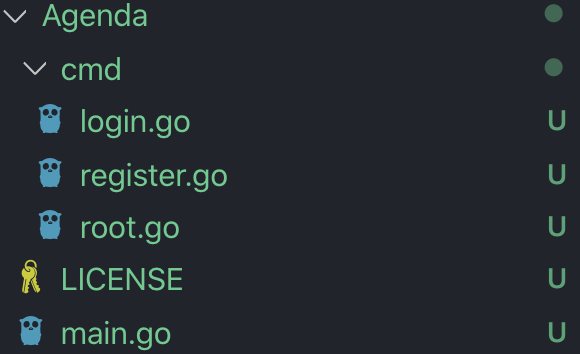

# Go语言CLI命令行实用程序开发实战 - Agenda

> 实现了 `用户注册` 、`用户登陆` 两大功能，并应用了JSON数据存储和Log日志记录。

- [Go语言CLI命令行实用程序开发实战 - Agenda](#go%e8%af%ad%e8%a8%80cli%e5%91%bd%e4%bb%a4%e8%a1%8c%e5%ae%9e%e7%94%a8%e7%a8%8b%e5%ba%8f%e5%bc%80%e5%8f%91%e5%ae%9e%e6%88%98---agenda)
  - [一、项目初始化](#%e4%b8%80%e9%a1%b9%e7%9b%ae%e5%88%9d%e5%a7%8b%e5%8c%96)
  - [二、用户注册实现（`cmd/register.go`）](#%e4%ba%8c%e7%94%a8%e6%88%b7%e6%b3%a8%e5%86%8c%e5%ae%9e%e7%8e%b0cmdregistergo)
  - [三、用户登录实现（`cmd/login.go`）](#%e4%b8%89%e7%94%a8%e6%88%b7%e7%99%bb%e5%bd%95%e5%ae%9e%e7%8e%b0cmdlogingo)
  - [四、代码运行与测试](#%e5%9b%9b%e4%bb%a3%e7%a0%81%e8%bf%90%e8%a1%8c%e4%b8%8e%e6%b5%8b%e8%af%95)

## 一、项目初始化

安装完Cobra后，使用 `cobra init Agenda` 生成Agenda项目目录，而后用
``` shell
cobra add register
cobra add login
```
向Agenda项目中加入register和login命令。<br>
完成初始化后，Agenda项目目录如下所示：


## 二、用户注册实现（`cmd/register.go`）

在 `func init` 中定义所需Flags：
``` Go
rootCmd.AddCommand(registerCmd)
registerCmd.Flags().StringP("user", "u", "Anonymous", "User Name")
registerCmd.Flags().StringP("password", "p", "", "User Password")
registerCmd.Flags().StringP("email", "e", "", "User E-mail")
registerCmd.Flags().StringP("phone", "n", "", "User Phone Number")
```

在文件中定义一个结构体，以便将数据转化为JSON格式：
``` Go
type UserInf struct {
	Username string
	Password string
	Email    string
	Phone    string
}
```

获取命令中Flag内容，并将其转化为JSON格式的数据，注意这里的 `json.MarshalIndent` 使JSON数据带有缩进。
``` Go
username, _ := cmd.Flags.GetString("user")
password, _ := cmd.Flags.GetString("password")
email, _ := cmd.Flags().GetStri("email")
phone, _ := cmd.Flags().GetStri("phone"
userInf := UserInf{
	Username: username,
	Password: password,
	Email:    email,
	Phone:    phone,

userInfJSONData, err :json.MarshalIndent(userInf, "", "  ")
if err != nil {
	log.Fatal(err)
}
```

将JSON数据写入文件。每个用户的数据都会存在 `UserInformation` 目录下以用户名命名的.json文件中。当发现已有与当前注册用户同名的文件，即可判断是重复注册，报错。
```Go
userInfFile, err := os.OpenFile(filepath.FromSlash("UserInformation/"+username+".json"), os.O_CREATE|os.O_EXCL|os.O_WRONLY|os.O_APPEND, 0666)
		if err != nil {
			if os.IsExist(err) {
				fmt.Println("\nRegister Failed! User already exists!")
			}
			log.Fatal(err)
		}
defer userInfFile.Close()
userInfFile.Write(userInfJSONData)
```

将注册成功的消息写入日志：
```Go
logFile, err := os.OpenFile("Agenda.log", os.O_RDWR|os.O_CREATE|os.O_APPEND, 0666)
		if err != nil {
			log.Fatal(err)

		}
defer logFile.Close()

registerLog := log.New(logFile, "[User Register] ", log.LstdFlags)
registerLog.Println(username + " Registered Successfully!")
```

命令行输出注册成功的反馈：
```Go
fmt.Println(username + " Registered Successfully!")
```


## 三、用户登录实现（`cmd/login.go`）
在 `func init` 中定义所需Flags：
``` Go
rootCmd.AddCommand(loginCmd)
loginCmd.Flags().StringP("loginUser", "U", "Anonymous", "login User Name")
loginCmd.Flags().StringP("loginPassword", "P", "", "login User Password")
```

获取命令中Flag内容，并读取 `UserInformation` 目录下以用户名命名的.json文件。如果文件不存在，则说明该用户还未注册，给出“用户不存在”的反馈。<br>
若文件存在，则读取文件中的内容。
```Go
username, _ := cmd.Flags().GetString("loginUser")
password, _ := cmd.Flags.GetString("loginPassword"
userInfFile, err := os.OpenFi(filepath.FromSla("UserInformation/"+userna+".json"), os.O_RDONLY, 0666)
if err != nil {
	if os.IsNotExist(err) {
		fmt.Println("\nLogiFailed! User doesn'exist!")
	}
	log.Fatal(err)
}
defer userInfFile.Close()
data := make([]byte, 4096)
dataLength, err := userInfFile.Re(data)
if err != nil {
	log.Fatal(err)
}
```

将读取到的JSON数据解码到 `UserInf` 结构体中：
```Go
var userInf UserInf
JSONerr := json.Unmarshal(da[:dataLength], &userInf)
if JSONerr != nil {
	log.Fatal(JSONerr)
```

如果从命令中Flag得到的密码和文件中保存的用户密码不同，则反馈“密码错误”；若相同，则将当前用户名写入 `curUser.txt` 中，并在日志中记录该次登陆操作，在命令行中反馈“登录成功”。
```Go
if userInf.Password != password {
	log.Fatal("Login FailedPassword is incorrect!")

currentUserFile, err := os.OpenFi("curUser.txt", os.O_RDWos.O_CREATE|os.O_TRUNC, 0666)
if err != nil {
	log.Fatal(err)
}
currentUserFile.Write([]by(userInf.Username)
logFile, err := os.OpenFi("Agenda.log", os.O_RDWos.O_CREATE|os.O_APPEND, 0666)
if err != nil {
	log.Fatal(err
}
defer logFile.Close(
registerLog := log.New(logFile,[User Login] ", log.LstdFlags)
registerLog.Println(username + Login Successfully!"
fmt.Println(username + " LogiSuccessfully!")
```

## 四、代码运行与测试
将Agenda项目放入 `$GOPATH/src` 中，在命令行中进入 `$GOPATH/src` ，执行 `go install Agenda` 这样一来即可在全局执行Agenda命令

__注：若要如此部署Agenda应用，需要先将代码中的文件路径改为*绝对路径*。而上文展示的代码，以及本github目录下所附的代码中文件路径是*相对路径*，这时可在项目所在目录中，用 `go run main.go register` 和 `go run main.go login` 来运行。__

注册用户Million：
```shell
Agenda register --user Million --password 123456 --email a@b.com --phone 8888
```


重复注册用户Million：
```shell
Agenda register --user Million --password 123456 --email a@b.com --phone 8888
```


注册用户Benjamin：
```shell
Agenda register --user Benjamin --password 123456 --email c@d.com --phone 9999
```


查看此时 `UserInformation` 文件夹下文件情况：
```shell
ls /Users/apple/go/src/Agenda/UserInformation
```


此时 `Milliion.json` 中的内容：


用不存在的用户进行登录：
```shell
Agenda login --loginUser Bob --loginPassword 123456
```


登录Million账户：
```shell
Agenda login --loginUser Million --loginPassword 123456
```


此时 `curUser.txt` 中的内容：


日志内容：


