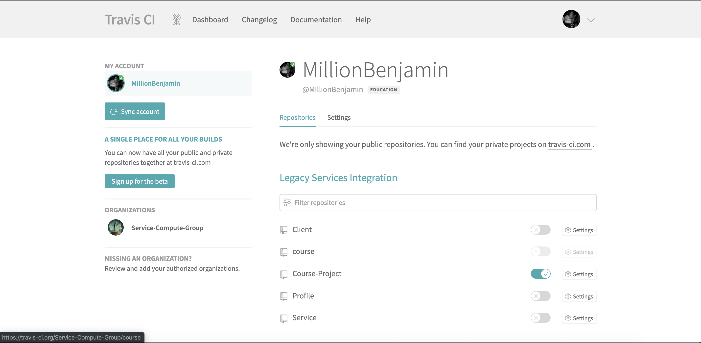
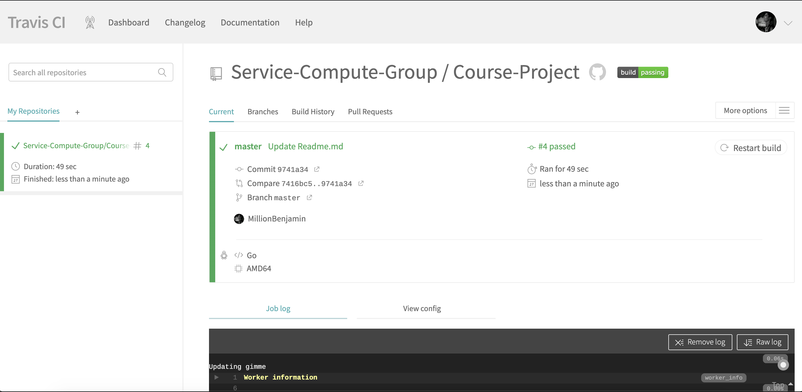

# 简单 web 服务与客户端开发实战-使用 travis 测试相关模块

> [点此访问](https://github.com/Service-Compute-Group/Course-Project)完整项目仓库。本篇文档是travis测试模块的部署说明。

- [简单 web 服务与客户端开发实战-使用 travis 测试相关模块](#%e7%ae%80%e5%8d%95-web-%e6%9c%8d%e5%8a%a1%e4%b8%8e%e5%ae%a2%e6%88%b7%e7%ab%af%e5%bc%80%e5%8f%91%e5%ae%9e%e6%88%98-%e4%bd%bf%e7%94%a8-travis-%e6%b5%8b%e8%af%95%e7%9b%b8%e5%85%b3%e6%a8%a1%e5%9d%97)
  - [一、CI与Travis CI](#%e4%b8%80ci%e4%b8%8etravis-ci)
  - [二、在本项目中部署Travis](#%e4%ba%8c%e5%9c%a8%e6%9c%ac%e9%a1%b9%e7%9b%ae%e4%b8%ad%e9%83%a8%e7%bd%b2travis)
    - [1. 在项目目录创建 .travis.yml 文件](#1-%e5%9c%a8%e9%a1%b9%e7%9b%ae%e7%9b%ae%e5%bd%95%e5%88%9b%e5%bb%ba-travisyml-%e6%96%87%e4%bb%b6)
    - [2.在Travis CI中构建](#2%e5%9c%a8travis-ci%e4%b8%ad%e6%9e%84%e5%bb%ba)
  - [三、在项目文档中添加 build:passing 标签](#%e4%b8%89%e5%9c%a8%e9%a1%b9%e7%9b%ae%e6%96%87%e6%a1%a3%e4%b8%ad%e6%b7%bb%e5%8a%a0-buildpassing-%e6%a0%87%e7%ad%be)

## 一、CI与Travis CI
CI即Continuous integration，持续集成。是一种软件工程流程，是将所有软件工程师对于软件的工作副本持续集成到共享主线（mainline）的一种举措。

在一个项目中，任何人对代码库的任何改动，都会触发CI服务器自动对项目进行构建，自动运行测试，甚至自动部署到测试环境。这样做的好处就是，随时发现问题，随时修复。因为修复问题的成本随着时间的推移而增长，越早发现，修复成本越低。

[Travis CI](https://travis-ci.org/)是一个在线的，分布式的持续集成服务，用来构建及测试托管在GitHub的代码。

用Travis CI来进行持续集成，不需要自己搭建服务器，只需在其网站上进行操作即可。Travis CI对开源项目是免费的。

## 二、在本项目中部署Travis
### 1. 在项目目录创建 `.travis.yml` 文件
`.travis.yml` 文件定义了Travis CI在这个项目上的行为，即告知Travis CI应该进行哪些操作。

对于本项目，需要指定代码语言为go语言，测试 `main.go` 中的代码（`main.go` 中调用了项目中所有其他go代码）。于是在 `.travis.yml` 文件中写入以下内容：
``` yaml
language: go
script: go test -v ./main.go
```

关于Travis CI在Go语言项目上的部署（Go项目中 `.travis.yml` 文件的语法），可以参考我的博客[Travis CI - Building a Go Project（Travis CI-建立Go项目）官方文档翻译](https://millionbenjamin.github.io/Service-Computing/Blogs/Blog5_Travis_CI-Building-a-Go-Project_translation/content)

### 2.在Travis CI中构建
访问可以在开源项目上免费使用的[Travis CI网站](https://travis-ci.org/)，点击Sign up用github账户进行登陆。

向Travis CI中添加要进行CI的项目：


点击build项目，查看结果。可在 `Job log` 中查看日志输出；在 `View config` 中查看使用的配置选项：


## 三、在项目文档中添加 `build:passing` 标签
在 `.md` 文档中加入该图片即可：
``` markdown
[](https://travis-ci.org/michaelliao/openweixin)
```


