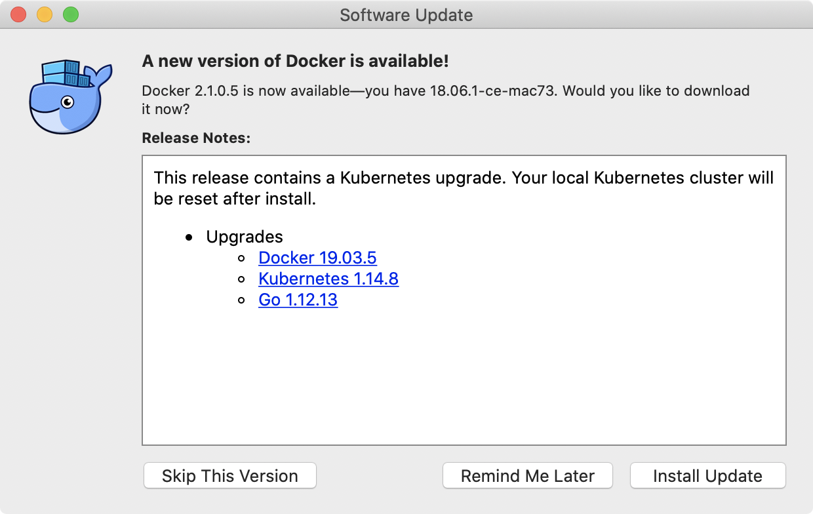
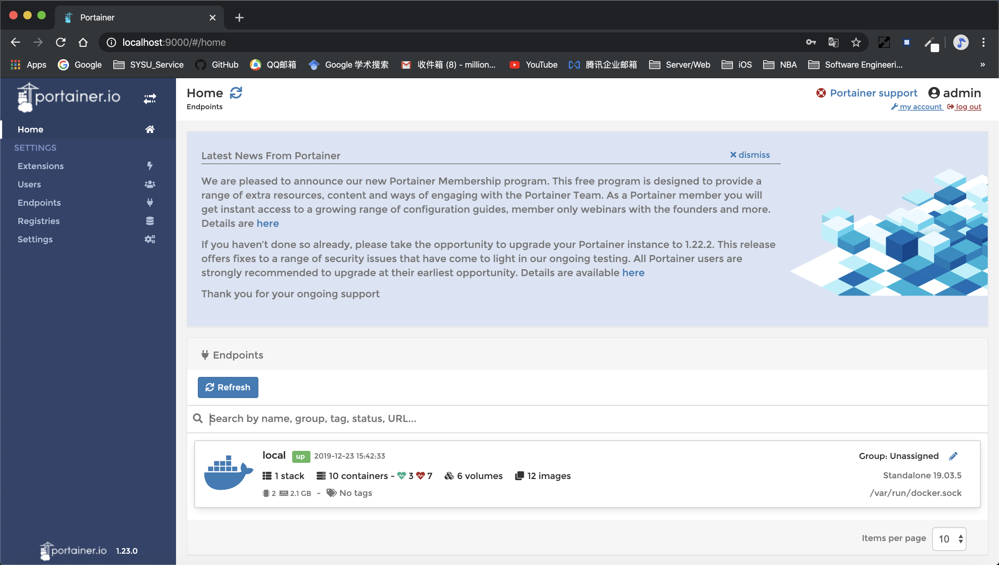

# 根据课件内容使用Docker

- [根据课件内容使用Docker](#%e6%a0%b9%e6%8d%ae%e8%af%be%e4%bb%b6%e5%86%85%e5%ae%b9%e4%bd%bf%e7%94%a8docker)
  - [一、准备Docker环境](#%e4%b8%80%e5%87%86%e5%a4%87docker%e7%8e%af%e5%a2%83)
  - [二、运行第一个容器](#%e4%ba%8c%e8%bf%90%e8%a1%8c%e7%ac%ac%e4%b8%80%e4%b8%aa%e5%ae%b9%e5%99%a8)
  - [三、Docker基本操作](#%e4%b8%89docker%e5%9f%ba%e6%9c%ac%e6%93%8d%e4%bd%9c)
    - [1. 运行镜像](#1-%e8%bf%90%e8%a1%8c%e9%95%9c%e5%83%8f)
    - [2. 显示本地镜像库内容](#2-%e6%98%be%e7%a4%ba%e6%9c%ac%e5%9c%b0%e9%95%9c%e5%83%8f%e5%ba%93%e5%86%85%e5%ae%b9)
    - [3. 获得帮助](#3-%e8%8e%b7%e5%be%97%e5%b8%ae%e5%8a%a9)
    - [4. 显示运行中容器](#4-%e6%98%be%e7%a4%ba%e8%bf%90%e8%a1%8c%e4%b8%ad%e5%ae%b9%e5%99%a8)
    - [5. 显示所有容器（包含已中止）](#5-%e6%98%be%e7%a4%ba%e6%89%80%e6%9c%89%e5%ae%b9%e5%99%a8%e5%8c%85%e5%90%ab%e5%b7%b2%e4%b8%ad%e6%ad%a2)
  - [四、MySQL与容器化](#%e5%9b%9bmysql%e4%b8%8e%e5%ae%b9%e5%99%a8%e5%8c%96)
    - [1. 拉取 MySQL 镜像](#1-%e6%8b%89%e5%8f%96-mysql-%e9%95%9c%e5%83%8f)
    - [2. 构建docker镜像练习](#2-%e6%9e%84%e5%bb%badocker%e9%95%9c%e5%83%8f%e7%bb%83%e4%b9%a0)
      - [I. 创建文件夹与文件](#i-%e5%88%9b%e5%bb%ba%e6%96%87%e4%bb%b6%e5%a4%b9%e4%b8%8e%e6%96%87%e4%bb%b6)
      - [II. 构建镜像](#ii-%e6%9e%84%e5%bb%ba%e9%95%9c%e5%83%8f)
      - [III. 运行镜像](#iii-%e8%bf%90%e8%a1%8c%e9%95%9c%e5%83%8f)
    - [3. 使用MySQL容器](#3-%e4%bd%bf%e7%94%a8mysql%e5%ae%b9%e5%99%a8)
      - [I. 启动服务器并查看](#i-%e5%90%af%e5%8a%a8%e6%9c%8d%e5%8a%a1%e5%99%a8%e5%b9%b6%e6%9f%a5%e7%9c%8b)
      - [II. 启动 MySQL 客户端](#ii-%e5%90%af%e5%8a%a8-mysql-%e5%ae%a2%e6%88%b7%e7%ab%af)
    - [4. 查看数据库文件](#4-%e6%9f%a5%e7%9c%8b%e6%95%b0%e6%8d%ae%e5%ba%93%e6%96%87%e4%bb%b6)
  - [五、Docker网络](#%e4%ba%94docker%e7%bd%91%e7%bb%9c)
    - [1. 备制支持 ifconfig 和 ping 命令的 ubuntu 容器](#1-%e5%a4%87%e5%88%b6%e6%94%af%e6%8c%81-ifconfig-%e5%92%8c-ping-%e5%91%bd%e4%bb%a4%e7%9a%84-ubuntu-%e5%ae%b9%e5%99%a8)
    - [2. 启动另一个命令窗口，由容器制作镜像](#2-%e5%90%af%e5%8a%a8%e5%8f%a6%e4%b8%80%e4%b8%aa%e5%91%bd%e4%bb%a4%e7%aa%97%e5%8f%a3%e7%94%b1%e5%ae%b9%e5%99%a8%e5%88%b6%e4%bd%9c%e9%95%9c%e5%83%8f)
    - [3. 创建自定义网络](#3-%e5%88%9b%e5%bb%ba%e8%87%aa%e5%ae%9a%e4%b9%89%e7%bd%91%e7%bb%9c)
    - [4. 在两个窗口创建 u1,u2 容器网络，并使用以下命令](#4-%e5%9c%a8%e4%b8%a4%e4%b8%aa%e7%aa%97%e5%8f%a3%e5%88%9b%e5%bb%ba-u1u2-%e5%ae%b9%e5%99%a8%e7%bd%91%e7%bb%9c%e5%b9%b6%e4%bd%bf%e7%94%a8%e4%bb%a5%e4%b8%8b%e5%91%bd%e4%bb%a4)
  - [六、容器监控与与日志](#%e5%85%ad%e5%ae%b9%e5%99%a8%e7%9b%91%e6%8e%a7%e4%b8%8e%e4%b8%8e%e6%97%a5%e5%bf%97)
    - [1. 检查docker的状态](#1-%e6%a3%80%e6%9f%a5docker%e7%9a%84%e7%8a%b6%e6%80%81)
    - [2. 查看容器内进程](#2-%e6%9f%a5%e7%9c%8b%e5%ae%b9%e5%99%a8%e5%86%85%e8%bf%9b%e7%a8%8b)
    - [3. 容器详细信息](#3-%e5%ae%b9%e5%99%a8%e8%af%a6%e7%bb%86%e4%bf%a1%e6%81%af)
  - [七、容器日志查看](#%e4%b8%83%e5%ae%b9%e5%99%a8%e6%97%a5%e5%bf%97%e6%9f%a5%e7%9c%8b)
  - [八、Docker图形化管理工具](#%e5%85%abdocker%e5%9b%be%e5%bd%a2%e5%8c%96%e7%ae%a1%e7%90%86%e5%b7%a5%e5%85%b7)
  - [九、实验心得](#%e4%b9%9d%e5%ae%9e%e9%aa%8c%e5%bf%83%e5%be%97)

## 一、准备Docker环境
先前已安装过MacOS Docker CE 18.06.1，运行Docker，根据提示进行升级。


升级后在命令行输入 `docker version` 查看版本：
``` 
(base) Millions-MacBook-Pro:~ apple$ docker version
Client: Docker Engine - Community
 Version:           19.03.5
 API version:       1.40
 Go version:        go1.12.12
 Git commit:        633a0ea
 Built:             Wed Nov 13 07:22:34 2019
 OS/Arch:           darwin/amd64
 Experimental:      false

Server: Docker Engine - Community
 Engine:
  Version:          19.03.5
  API version:      1.40 (minimum version 1.12)
  Go version:       go1.12.12
  Git commit:       633a0ea
  Built:            Wed Nov 13 07:29:19 2019
  OS/Arch:          linux/amd64
  Experimental:     true
 containerd:
  Version:          v1.2.10
  GitCommit:        b34a5c8af56e510852c35414db4c1f4fa6172339
 runc:
  Version:          1.0.0-rc8+dev
  GitCommit:        3e425f80a8c931f88e6d94a8c831b9d5aa481657
 docker-init:
  Version:          0.18.0
  GitCommit:        fec3683

```


## 二、运行第一个容器
在命令行中输入 `docker run hello-world`：
``` 
Millions-MacBook-Pro:~ apple$ docker run hello-world
Unable to find image 'hello-world:latest' locally
latest: Pulling from library/hello-world
1b930d010525: Pull complete 
Digest: sha256:4fe721ccc2e8dc7362278a29dc660d833570ec2682f4e4194f4ee23e415e1064
Status: Downloaded newer image for hello-world:latest

Hello from Docker!
This message shows that your installation appears to be working correctly.

To generate this message, Docker took the following steps:
 1. The Docker client contacted the Docker daemon.
 2. The Docker daemon pulled the "hello-world" image from the Docker Hub.
    (amd64)
 3. The Docker daemon created a new container from that image which runs the
    executable that produces the output you are currently reading.
 4. The Docker daemon streamed that output to the Docker client, which sent it
    to your terminal.

To try something more ambitious, you can run an Ubuntu container with:
 $ docker run -it ubuntu bash

Share images, automate workflows, and more with a free Docker ID:
 https://hub.docker.com/

For more examples and ideas, visit:
 https://docs.docker.com/get-started/
```


## 三、Docker基本操作
### 1. 运行镜像
``` 
Millions-MacBook-Pro:~ apple$ docker run -it ubuntu bash
Unable to find image 'ubuntu:latest' locally
latest: Pulling from library/ubuntu
2746a4a261c9: Pull complete 
4c1d20cdee96: Pull complete 
0d3160e1d0de: Pull complete 
c8e37668deea: Pull complete 
Digest: sha256:250cc6f3f3ffc5cdaa9d8f4946ac79821aafb4d3afc93928f0de9336eba21aa4
Status: Downloaded newer image for ubuntu:latest
root@c1c2f2b76827:/# 
```

### 2. 显示本地镜像库内容
``` 
Millions-MacBook-Pro:~ apple$ docker images
REPOSITORY                        TAG                 IMAGE ID            CREATED             SIZE
ubuntu                            latest              549b9b86cb8d        4 days ago          64.2MB
hello-world                       latest              fce289e99eb9        11 months ago       1.84kB
hyperledger/composer-playground   latest              22ad10364639        14 months ago       332MB
hyperledger/fabric-ccenv          1.2.1               8651e7160d88        15 months ago       1.43GB
hyperledger/fabric-orderer        1.2.1               b1a1dd788841        15 months ago       152MB
hyperledger/fabric-peer           1.2.1               ef0e7788ead0        15 months ago       159MB
hyperledger/fabric-ca             1.2.1               be8400395e15        15 months ago       251MB
hyperledger/fabric-couchdb        0.4.10              3092eca241fc        18 months ago       1.61GB

```

### 3. 获得帮助
> 返回信息较长，仅取部分进行展示
``` 
Millions-MacBook-Pro:~ apple$ docker --help

Usage:	docker [OPTIONS] COMMAND

A self-sufficient runtime for containers

Options:
      --config string      Location of client config files (default "/Users/apple/.docker")
  -c, --context string     Name of the context to use to connect to the daemon (overrides DOCKER_HOST env var and default context set with "docker context use")
  -D, --debug              Enable debug mode
  -H, --host list          Daemon socket(s) to connect to
  -l, --log-level string   Set the logging level ("debug"|"info"|"warn"|"error"|"fatal") (default "info")
      --tls                Use TLS; implied by --tlsverify
      --tlscacert string   Trust certs signed only by this CA (default "/Users/apple/.docker/ca.pem")
      --tlscert string     Path to TLS certificate file (default "/Users/apple/.docker/cert.pem")
      --tlskey string      Path to TLS key file (default "/Users/apple/.docker/key.pem")
      --tlsverify          Use TLS and verify the remote
  -v, --version            Print version information and quit

```

### 4. 显示运行中容器
``` 
Millions-MacBook-Pro:~ apple$ docker ps
CONTAINER ID        IMAGE               COMMAND             CREATED             STATUS              PORTS               NAMES
```

### 5. 显示所有容器（包含已中止）
``` 
Millions-MacBook-Pro:~ apple$ docker ps -a
CONTAINER ID        IMAGE                               COMMAND                  CREATED             STATUS                       PORTS                                            NAMES
c1c2f2b76827        ubuntu                              "bash"                   7 minutes ago       Exited (1) 4 minutes ago                                                      hardcore_edison
709b2a4358bc        hello-world                         "/hello"                 12 minutes ago      Exited (0) 12 minutes ago                                                     quizzical_tharp
3989911bcfc3        hyperledger/fabric-peer:1.2.1       "peer node start"        13 months ago       Exited (255) 12 months ago   0.0.0.0:7051->7051/tcp, 0.0.0.0:7053->7053/tcp   peer0.org1.example.com
9b673d8ed24f        hyperledger/fabric-couchdb:0.4.10   "tini -- /docker-ent…"   13 months ago       Exited (255) 12 months ago   4369/tcp, 9100/tcp, 0.0.0.0:5984->5984/tcp       couchdb
5880bfb0c47c        hyperledger/fabric-ca:1.2.1         "sh -c 'fabric-ca-se…"   13 months ago       Exited (255) 12 months ago   0.0.0.0:7054->7054/tcp                           ca.org1.example.com
e618bac206ac        hyperledger/fabric-orderer:1.2.1    "orderer"                13 months ago       Exited (255) 12 months ago   0.0.0.0:7050->7050/tcp                           orderer.example.com
```

## 四、MySQL与容器化
### 1. 拉取 MySQL 镜像
``` 
Millions-MacBook-Pro:~ apple$ docker pull mysql:5.7
5.7: Pulling from library/mysql
d599a449871e: Pull complete 
f287049d3170: Pull complete 
08947732a1b0: Pull complete 
96f3056887f2: Pull complete 
871f7f65f017: Pull complete 
1dd50c4b99cb: Pull complete 
5bcbdf508448: Pull complete 
02a97db830bd: Pull complete 
c09912a99bce: Pull complete 
08a981fc6a89: Pull complete 
818a84239152: Pull complete 
Digest: sha256:5779c71a4730da36f013a23a437b5831198e68e634575f487d37a0639470e3a8
Status: Downloaded newer image for mysql:5.7
docker.io/library/mysql:5.7

```

### 2. 构建docker镜像练习
#### I. 创建文件夹与文件
``` shell
mkdir mydock && cd mydock
vim dockerfile
```
向dockerfile中写入：
``` bash
FROM ubuntu
ENTRYPOINT ["top", "-b"]
CMD ["-c"]
```
#### II. 构建镜像
```
Millions-MacBook-Pro:mydock apple$ docker build . -t hello
Sending build context to Docker daemon  2.048kB
Step 1/3 : FROM ubuntu
 ---> 549b9b86cb8d
Step 2/3 : ENTRYPOINT ["top", "-b"]
 ---> Running in c3fbb443127c
Removing intermediate container c3fbb443127c
 ---> 0afd39fc3a59
Step 3/3 : CMD ["-c"]
 ---> Running in 4db8c057dfe6
Removing intermediate container 4db8c057dfe6
 ---> 0538f305bf4c
Successfully built 0538f305bf4c
Successfully tagged hello:latest
```
#### III. 运行镜像
> 返回信息较长，仅取部分进行展示
```
Millions-MacBook-Pro:mydock apple$ docker run -it --rm hello -H  
top - 07:09:10 up 33 min,  0 users,  load average: 0.05, 0.01, 0.01
Threads:   1 total,   1 running,   0 sleeping,   0 stopped,   0 zombie
%Cpu(s):  0.5 us,  0.7 sy,  0.0 ni, 98.6 id,  0.1 wa,  0.0 hi,  0.1 si,  0.0 st
KiB Mem :  2047132 total,   465336 free,   485080 used,  1096716 buff/cache
KiB Swap:  1048572 total,  1048572 free,        0 used.  1400788 avail Mem 

  PID USER      PR  NI    VIRT    RES    SHR S %CPU %MEM     TIME+ COMMAND
    1 root      20   0   36480   3100   2748 R  0.0  0.2   0:00.03 top

```


### 3. 使用MySQL容器
#### I. 启动服务器并查看
> 3306端口已被系统原本的mysql占用，这里使用3307端口
``` 
Millions-MacBook-Pro:~ apple$ sudo docker run -p 3307:3307 --name mysql2 -e MYSQL_ROOT_PASSWORD=root -d mysql:5.7
47a7010e369cb5bc2b98a2a1aa396cd6fb76a6d1a124582bfeada8c96af6c08f
```
```
Millions-MacBook-Pro:mydock apple$ docker ps
CONTAINER ID        IMAGE               COMMAND                  CREATED             STATUS              PORTS                                         NAMES
47a7010e369c        mysql:5.7           "docker-entrypoint.s…"   8 minutes ago       Up 8 minutes        3306/tcp, 33060/tcp, 0.0.0.0:3307->3307/tcp   mysql2
```
#### II. 启动 MySQL 客户端
```
# mysql -h127.0.0.1 -P3307 -uroot -proot
mysql: [Warning] Using a password on the command line interface can be insecure.
```


### 4. 查看数据库文件
``` 
Millions-MacBook-Pro:mydock apple$ docker exec -it mysql2 bash
root@47a7010e369c:/# ls /var/lib/mysql
auto.cnf    ca.pem	     client-key.pem  ib_logfile0  ibdata1  mysql	       private_key.pem	server-cert.pem  sys
ca-key.pem  client-cert.pem  ib_buffer_pool  ib_logfile1  ibtmp1   performance_schema  public_key.pem	server-key.pem
```


## 五、Docker网络
### 1. 备制支持 ifconfig 和 ping 命令的 ubuntu 容器
登入ubuntu镜像
```shell
docker run --name unet -it --rm ubuntu bash
```

依次运行以下命令：
```shell
apt-get update
apt-get install net-tools
apt-get install iputils-ping -y
```

查看网络配置
```
root@431415e1271b:/# ifconfig
eth0: flags=4163<UP,BROADCAST,RUNNING,MULTICAST>  mtu 1500
        inet 172.17.0.3  netmask 255.255.0.0  broadcast 172.17.255.255
        ether 02:42:ac:11:00:03  txqueuelen 0  (Ethernet)
        RX packets 13122  bytes 18441184 (18.4 MB)
        RX errors 0  dropped 0  overruns 0  frame 0
        TX packets 7229  bytes 395632 (395.6 KB)
        TX errors 0  dropped 0 overruns 0  carrier 0  collisions 0

lo: flags=73<UP,LOOPBACK,RUNNING>  mtu 65536
        inet 127.0.0.1  netmask 255.0.0.0
        loop  txqueuelen 1  (Local Loopback)
        RX packets 0  bytes 0 (0.0 B)
        RX errors 0  dropped 0  overruns 0  frame 0
        TX packets 0  bytes 0 (0.0 B)
        TX errors 0  dropped 0 overruns 0  carrier 0  collisions 0
```

尝试ping
```
root@431415e1271b:/# ping 127.0.0.1
PING 127.0.0.1 (127.0.0.1) 56(84) bytes of data.
64 bytes from 127.0.0.1: icmp_seq=1 ttl=64 time=0.040 ms
64 bytes from 127.0.0.1: icmp_seq=2 ttl=64 time=0.063 ms
64 bytes from 127.0.0.1: icmp_seq=3 ttl=64 time=0.154 ms
64 bytes from 127.0.0.1: icmp_seq=4 ttl=64 time=0.064 ms
64 bytes from 127.0.0.1: icmp_seq=5 ttl=64 time=0.062 ms
^C
--- 127.0.0.1 ping statistics ---
5 packets transmitted, 5 received, 0% packet loss, time 4183ms
rtt min/avg/max/mdev = 0.040/0.076/0.154/0.040 ms
```

### 2. 启动另一个命令窗口，由容器制作镜像
```
Millions-MacBook-Pro:~ apple$ docker commit unet ubuntu:net
sha256:efea8bb9b40b5f7547c8b15dfc1b92f35001209d61f6c50455ce9463df6ef745
```

### 3. 创建自定义网络
```
Millions-MacBook-Pro:~ apple$ docker network create mynet
7cbbef29417e5d61c986b68fd63c8d81e529f2c983dd5997b904016640bfa2c4
```

### 4. 在两个窗口创建 u1,u2 容器网络，并使用以下命令 
```
docker run --name u1 -it -p 8080:80 --net mynet --rm ubuntu:net bash
docker run --name u2 --net mynet -it --rm ubuntu:net bash
docker info u1
docker network connect bridge u1
docker network disconnect mynet u1
```

## 六、容器监控与与日志
### 1. 检查docker的状态
```
Millions-MacBook-Pro:mydock apple$ docker info 
Client:
 Debug Mode: false

Server:
 Containers: 8
  Running: 1
  Paused: 0
  Stopped: 7
 Images: 12
 Server Version: 19.03.5
 Storage Driver: overlay2
  Backing Filesystem: extfs
  Supports d_type: true
  Native Overlay Diff: true
 Logging Driver: json-file
 Cgroup Driver: cgroupfs
 Plugins:
  Volume: local
  Network: bridge host ipvlan macvlan null overlay
  Log: awslogs fluentd gcplogs gelf journald json-file local logentries splunk syslog
 Swarm: inactive
 Runtimes: runc
 Default Runtime: runc
 Init Binary: docker-init
 containerd version: b34a5c8af56e510852c35414db4c1f4fa6172339
 runc version: 3e425f80a8c931f88e6d94a8c831b9d5aa481657
 init version: fec3683
 Security Options:
  seccomp
   Profile: default
 Kernel Version: 4.9.184-linuxkit
 Operating System: Docker Desktop
 OSType: linux
 Architecture: x86_64
 CPUs: 2
 Total Memory: 1.952GiB
 Name: docker-desktop
 ID: 5WGU:TCSG:WPLM:S2WN:ZIJ2:UPYN:O73L:HVMW:JGFJ:TT3R:DUXD:7A6Y
 Docker Root Dir: /var/lib/docker
 Debug Mode: true
  File Descriptors: 37
  Goroutines: 50
  System Time: 2019-12-23T07:33:43.828657467Z
  EventsListeners: 2
 HTTP Proxy: gateway.docker.internal:3128
 HTTPS Proxy: gateway.docker.internal:3129
 Registry: https://index.docker.io/v1/
 Labels:
 Experimental: true
 Insecure Registries:
  127.0.0.0/8
 Live Restore Enabled: false
 Product License: Community Engine
```

```
Millions-MacBook-Pro:mydock apple$ docker info --format {{.ServerVersion}}
19.03.5
```

### 2. 查看容器内进程
```
Millions-MacBook-Pro:mydock apple$ docker stats

CONTAINER ID        NAME                CPU %               MEM USAGE / LIMIT     MEM %               NET I/O             BLOCK I/O           PIDS
47a7010e369c        mysql2              0.18%               180.9MiB / 1.952GiB   9.05%               1.52kB / 138B       4.1kB / 1.24GB      27

```

### 3. 容器详细信息
> 这里运行了一个在9b6117e97764的ubuntu镜像
```
Millions-MacBook-Pro:mydock apple$ docker inspect -f '{{.NetworkSettings}}' 9b6117e97764
{{ 95c91a0f3877f87ca990bb70d881304b912b5721a83d3164d7de4d1f1385ff1c false  0 map[] /var/run/docker/netns/95c91a0f3877 [] []} {   0  0  } map[mynet:0xc00002a0c0]}
```

## 七、容器日志查看
> 查看在9b6117e97764的ubuntu镜像
```
Millions-MacBook-Pro:mydock apple$ docker logs 9b6117e97764
root@9b6117e97764:/# ifconfig
eth0: flags=4163<UP,BROADCAST,RUNNING,MULTICAST>  mtu 1500
        inet 172.19.0.2  netmask 255.255.0.0  broadcast 172.19.255.255
        ether 02:42:ac:13:00:02  txqueuelen 0  (Ethernet)
        RX packets 10  bytes 828 (828.0 B)
        RX errors 0  dropped 0  overruns 0  frame 0
        TX packets 0  bytes 0 (0.0 B)
        TX errors 0  dropped 0 overruns 0  carrier 0  collisions 0

lo: flags=73<UP,LOOPBACK,RUNNING>  mtu 65536
        inet 127.0.0.1  netmask 255.0.0.0
        loop  txqueuelen 1  (Local Loopback)
        RX packets 0  bytes 0 (0.0 B)
        RX errors 0  dropped 0  overruns 0  frame 0
        TX packets 0  bytes 0 (0.0 B)
        TX errors 0  dropped 0 overruns 0  carrier 0  collisions 0
```

## 八、Docker图形化管理工具
```
Millions-MacBook-Pro:mydock apple$ docker run -d -p 9000:9000 -v /var/run/docker.sock:/var/run/docker.sock portainer/portainer
Unable to find image 'portainer/portainer:latest' locally
latest: Pulling from portainer/portainer
d1e017099d17: Pull complete 
cc61cd4105c3: Pull complete 
Digest: sha256:c016f0e9b92b2dd4fe097d91ace2f21ed3ce34ade43ee2a95d3d4da1e984b96f
Status: Downloaded newer image for portainer/portainer:latest
dd66db9d4157ac61b32e1b9eb8f7c4d9844be314fee5ade883619add3030d01a
```
然后访问 localhost:9000 根据提示创建用户，进入本地Docker管理界面：


## 九、实验心得
尽管之前接触过Docker，但没有系统、完整地学习过Docker的各项操作。本次实验中，我初步掌握了Docker运行镜像、Docker网络和Docker运维等各项操作。相信在之后的学习、应用中可以继续熟悉Docker。


